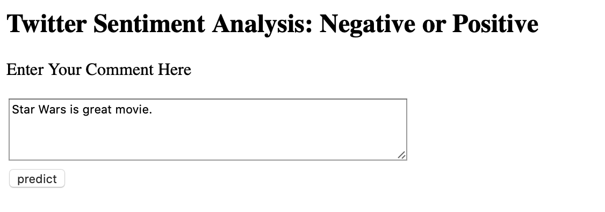

# Sentiment_Analysis_AWS_ECS
Implementing sentiment analysis using aws ecs with docker.

# Modules
```bash

pip3 install -r requirements.txt

```

# Results

### Output from raw text




### Output as of json isntance


